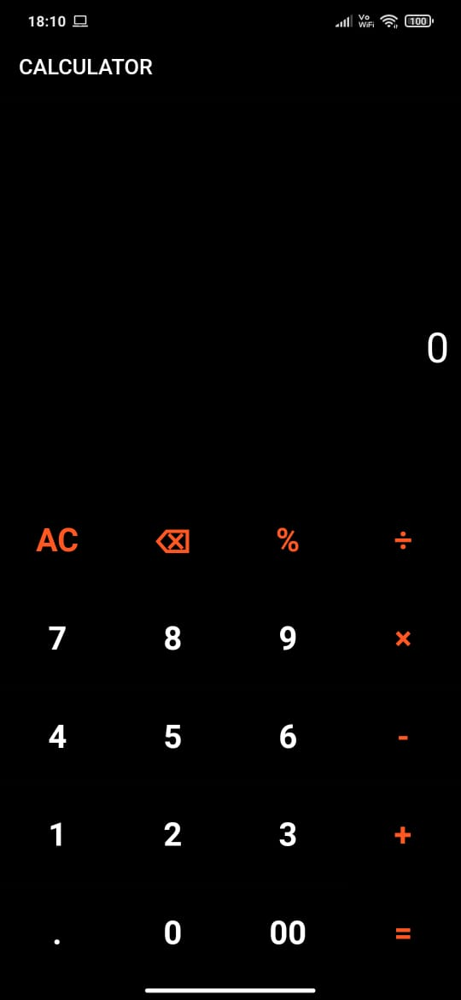
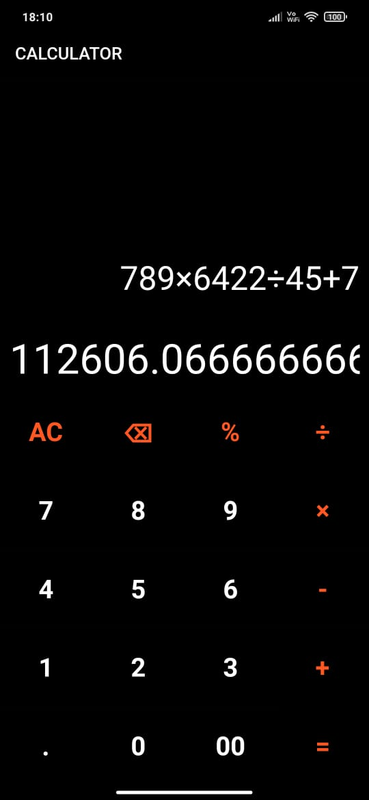
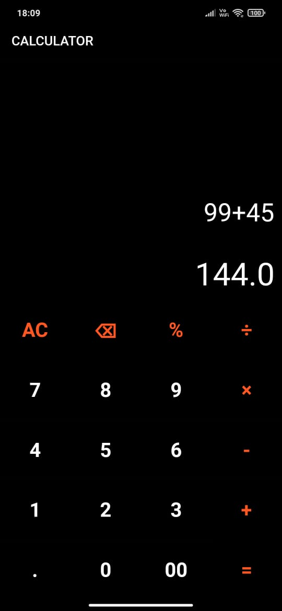

# new_calculator_app

A simple calculator app.

## Working

This project is a simple calculator which can take in an expression and then evaluates it once button labeled "=" is pressed. 

The expressions are evaluated using the math expression solver dart package.

Calculator's layout is created using a column widget. The column is aligned in a bottom-up way and therefore, the first child of the column is a row used for the numbers and operands. The second and third children are the containers, used for displaying the equation and result. The containers are wrapped in a SingleChildScrollView widget to achieve scrolling effects, once text overflow occurs in them to avoid pixel overflow in the screen.

The stateless class Calculator is responsible for the theme of the application, whereas the rest of the programming implementation is done in the statefull class Simple Calculator. The stateless class then calls upon the statefull class in the home attribute.

The calculator can handle simple arithmetic operations in the double floating point integers.

You have to scroll down to view the operands you input once the operands have overflowed in the input text section.

The result scrolls horizontally if the answer is large, for accomodation purposes.

## Working Screenshots

